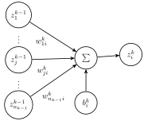

.. _layers:

======
Layers
======

In a standard feedforward neural network layer, each node :math:`i` in layer
:math:`k` receives inputs from all nodes in layer :math:`k-1`, then transforms
the weighted sum of these inputs:

.. math::
   z_i^k = \sigma\left( b_i^k + \sum_{j=1}^{n_{k-1}} w^k_{ji} z_j^{k-1} \right)

where :math:`\sigma: \mathbb{R} \to \mathbb{R}` is an :ref:`activation function
<activations>`.

In addition to standard feedforward layers, other types of layers are also
commonly used:

- For recurrent models, :mod:`recurrent layers <theanets.layers.recurrent>`
  permit a cycle in the computation graph that depends on a previous time step.

- For models that process images, :mod:`convolution layers
  <theanets.layers.convolution>` are common.

- For some types of autoencoder models, it is common to :class:`tie layer weights to
  another layer <theanets.layers.feedforward.Tied>`.

.. _layers-available:

Available Layers
================

.. automodule:: theanets.layers.base
   :no-members:
   :no-inherited-members:

.. autosummary::
   :toctree: generated/

   Layer
   Input
   Concatenate
   Flatten
   Product
   Reshape

Feedforward
-----------

.. automodule:: theanets.layers.feedforward
   :no-members:
   :no-inherited-members:

.. autosummary::
   :toctree: generated/

   Classifier
   Feedforward
   Tied

Convolution
-----------

.. automodule:: theanets.layers.convolution
   :no-members:
   :no-inherited-members:

.. autosummary::
   :toctree: generated/

   Conv1
   Conv2
   Pool1
   Pool2

Recurrent
---------

.. automodule:: theanets.layers.recurrent
   :no-members:
   :no-inherited-members:

.. autosummary::
   :toctree: generated/

   RNN
   RRNN
   MUT1
   GRU
   LSTM
   MRNN
   SCRN
   Clockwork
   Bidirectional

.. _layers-attributes:

Layer Attributes
================

Now that we've seen how to specify values for the attributes of each layer in
your model, we'll look at the available attributes that can be customized. For
many of these settings, you'll want to use a dictionary (or create a
:class:`theanets.Layer <theanets.layers.base.Layer>` instance yourself) to
specify non-default values.

- ``size``: The number of "neurons" in the layer. This value must be specified
  by the modeler when creating the layer. It can be specified by providing an
  integer, or as a tuple that contains an integer.

- ``form``: A string specifying the type of layer to use (see above). This
  defaults to "feedforward" but can be the name of any existing
  :class:`theanets.Layer <theanets.layers.base.Layer>` subclass (including
  :ref:`layers-custom` that you have defined).

- ``name``: A string name for the layer. If this isn't provided when creating a
  layer, the layer will be assigned a default name. The default names for the
  first and last layers in a network are ``'in'`` and ``'out'`` respectively,
  and the layers in between are assigned the name "hidN" where N is the number
  of existing layers.

  If you create a layer instance manually, the default name is ``'layerN'``
  where N is the number of existing layers.

- ``activation``: A string describing the :ref:`activation function
  <activations>` to use for the layer. This defaults to ``'relu'``.

- ``inputs``: An integer or dictionary describing the sizes of the inputs that
  this layer expects. This is normally optional and defaults to the size of the
  preceding layer in a chain-like model. However, providing a dictionary here
  permits arbitrary layer interconnections. See :ref:`guide-advanced-graphs` for
  more details.

- ``mean``: A float specifying the mean of the initial parameter values to use
  in the layer. Defaults to 0. This value applies to all parameters in the model
  that don't have mean values specified for them directly.

- ``mean_ABC``: A float specifying the mean of the initial parameter values to
  use in the layer's ``'ABC'`` parameter. Defaults to 0. This can be used to
  specify the mean of the initial values used for a specific parameter in the
  model.

- ``std``: A float specifying the standard deviation of the initial parameter
  values to use in the layer. Defaults to 1. This value applies to all
  parameters in the model that don't have standard deviations specified
  directly.

- ``std_ABC``: A float specifying the standard deviation of the initial
  parameter values to use in the layer's ``'ABC'`` parameter. Defaults to 1.
  This can be used to specify the standard deviation of the initial values used
  for a specific parameter in the model.

- ``sparsity``: A float giving the proportion of parameter values in the layer
  that should be initialized to zero. Nonzero values in the parameters will be
  drawn from a Gaussian with the specified mean and standard deviation as above,
  and then an appropriate number of these parameter values will randomly be
  reset to zero to make the parameter "sparse."

- ``sparsity_ABC``: A float or vector of floats used to initialize the
  parameters in the layer's ``'ABC'`` parameter. This can be used to set the
  initial sparsity level for a particular parameter in the layer.

- ``diagonal``: A float or vector of floats used to initialize the parameters in
  the layer. If this is provided, weight matrices in the layer will be
  initialized to all zeros, with this value or values placed along the diagonal.

- ``diagonal_ABC``: A float or vector of floats used to initialize the
  parameters in the layer's ``'ABC'`` parameter. If this is provided, the
  relevant weight matrix in the layer will be initialized to all zeros, with
  this value or values placed along the diagonal.

- ``rng``: An integer or ``numpy`` random number generator. If specified the
  given random number generator will be used to create the initial values for
  the parameters in the layer. This can be useful for repeatable runs of a
  model.

In addition to these configuration values, each layer can also be provided with
keyword arguments specific to that layer. For example, the :class:`MRNN
<theanets.layers.recurrent.MRNN>` recurrent layer type requires a ``factors``
argument, and the :class:`Conv1 <theanets.layers.convolution.Conv1>` 1D
convolutional layer requires a ``filter_size`` argument.

.. _layers-custom:

Custom Layers
=============

Layers are the real workhorse in ``theanets``; custom layers can be created to
do all sorts of fun stuff. To create a custom layer, just create a subclass of
:class:`theanets.Layer <theanets.layers.base.Layer>` and give it the
functionality you want.

As a very simple example, let's suppose you wanted to create a normal
feedforward layer but did not want to include a bias term:

.. code:: python

  import theanets
  import theano.tensor as TT

  class NoBias(theanets.Layer):
      def transform(self, inputs):
          return TT.dot(inputs, self.find('w'))

      def setup(self):
          self.add_weights('w', nin=self.input_size, nout=self.size)

Once you've set up your new layer class, it will automatically be registered and
available in :func:`theanets.Layer.build <theanets.layers.base.Layer.build>`
using the name of your class:

.. code:: python

  layer = theanets.Layer.build('nobias', size=4)

or, while creating a model:

.. code:: python

  net = theanets.Autoencoder(
      layers=(4, (3, 'nobias', 'linear'), (4, 'tied', 'linear')),
  )

This example shows how fast it is to create a PCA-like model that will learn the
subspace of your dataset that spans the most variance---the same subspace
spanned by the principal components.
