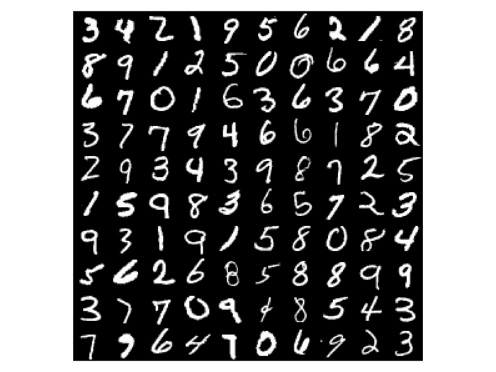

========================
Classifying MNIST Digits
========================

A standard benchmark for neural network :class:`classification
<theanets.feedforward.Classifier>` is the `MNIST digits dataset
<http://yann.lecun.com/exdb/mnist/>`_, a set of 70,000 28×28 images of
hand-written digits. Each MNIST digit is labeled with the correct digit class
(0, 1, ... 9). This example shows how to use ``theanets`` to create and train a
model that can perform this task.

Networks for classification map a layer of continuous-valued inputs, through one
or more hidden layers, to an output layer that is activated through the `softmax
function`_. The softmax generates output that can be treated as a categorical
distribution over the digit labels given the input image.

.. _softmax function: http://en.wikipedia.org/wiki/Softmax_function

Defining the model
------------------

Now that you know which model to use for this task, you'll need to define some
hyperparameters that determine the structure of your network. The most important
of these is choosing a set of layer sizes that you want in your model.

The first ("input") and last ("output") layers in your network must match the
size of the data you'll be providing. For an MNIST classification task, this
means your network must have 784 inputs (one for each image pixel) and 10
outputs (one for each class).

Between the input and output layers, on the other hand, can be any number of
so-called "hidden" layers, in almost any configuration. Models with more than
about two hidden layers are commonly called "deep" models and have been quite
popular recently due to their success on a variety of difficult machine learning
problems. For now, though, to keep things simple, let's start out with a model
that just has one hidden layer with 100 units.

Once you've chosen the layers you want in your model, you typically pass the
layers to the model constructor::

  net = theanets.Classifier(layers=[784, 100, 10])

This is all that's required to get started. There are many different
hyperparameters that can also be useful when constructing a model; see
:ref:`guide-creating` for more information. Particularly useful to know will be
the different ways of creating layers; see
:ref:`guide-creating-specifying-layers` for details.

Preparing the data
------------------

In ``theanets``, the parameters of a model are initialized randomly. To improve
the model's performance on the task, you'll need to train the model parameters.
This training process requires a dataset to compute gradient and loss function
values.

In the case of the MNIST digits, our classifier model will consume a dataset
consisting of two parts---"samples" (image pixels) and corresponding "labels"
(integer class values). Each of these parts is provided as a ``numpy`` array:
the samples are a two-dimensional array, with vectorized MNIST pixels arranged
along the first axis and pixel data arranged along the second axis; the labels
are a one-dimensional array, with one integer value per MNIST image.

For easy access to the MNIST digits dataset, we'll use the ``skdata`` package
and write a little bit of glue code to get the data into the desired format::

  def load_mnist():
      mnist = skdata.mnist.dataset.MNIST()
      mnist.meta  # trigger download if needed.
      def arr(n, dtype):
          # convert an array to the proper shape and dtype
          arr = mnist.arrays[n]
          return arr.reshape((len(arr), -1)).astype(dtype)
      train_images = arr('train_images', 'f') / 255.
      train_labels = arr('train_labels', np.uint8)
      test_images = arr('test_images', 'f') / 255.
      test_labels = arr('test_labels', np.uint8)
      return ((train_images[:50000], train_labels[:50000, 0]),
              (train_images[50000:], train_labels[50000:, 0]),
              (test_images, test_labels[:, 0]))

Here we've rescaled the image data so that each pixel lies in the interval [0,
1] instead of the default [0, 255]. (In general, it's a good idea to standardize
the data for your problem so that each dimension has approximately the same
scale.) We've also reshaped the data as described above.

.. note::

   Because ``theanets`` uses Theano for its computations, most datasets need to
   be cast to a value that is compatible with your setting for
   `Theano's "floatX" configuration parameter`_. Unless you have a really
   expensive GPU, this is likely to mean that you need to use 32-bit floats.

.. _Theano's "floatX" configuration parameter: http://deeplearning.net/software/theano/library/config.html#config.floatX

The load function returns a training split (the first 50000 examples), a
validation split (the remainder of the training data from ``skdata``, containing
10000 examples), and a test split (the test split from ``skdata``, containing
10000 examples). The training dataset is used to compute parameter updates, and
the validation dataset is used to determine when the model has stopped
improving during training.

There are other ways to provide data to your model during training; for a more
complete description, see :ref:`guide-training-providing-data`.

Training the model
------------------

Now that you have a model and some data, you're ready to train the model so that
it performs the classification task as well as possible. Models are set up to
handle training with fairly little work.

The main decision to make during training is to choose the training algorithm to
use, along with values for any associated hyperparameters. This is most
naturally accomplished using the :func:`Network.train()
<theanets.graph.Network.train>` method::

  train, valid, test = load_mnist()

  net.train(train,
            valid,
            algo='nag',
            learning_rate=1e-3,
            momentum=0.9)

The first positional argument to this method is the training dataset, and the
second (if provided) is a validation dataset. If a validation dataset is not
provided, the training dataset will be used for validation.

The ``algo`` keyword argument specifies an algorithm to use for training. If you
do not provide a value for this argument, :class:`RMSProp
<downhill.adaptive.RMSProp>` is currently used as the default training
algorithm. Any subsequent keyword arguments will be passed to the training
algorithm; these arguments typically specify hyperparameters of the algorithm
like the learning rate and so forth.

The available training methods are described in :ref:`trainers`; here we've
specified Nesterov's Accelerated Gradient, a type of stochastic gradient descent
with momentum.

Visualizing features
--------------------

Once you've trained a classification model for MNIST digits, it can be
informative to visually inspect the features that the model has learned. Because
the model was trained using the MNIST digits, you can reshape the learned
features and visualize them as though they were 28×28 images::

  img = np.zeros((28 * 10, 28 * 10), dtype='f')
  for i, pix in enumerate(net.find('hid1', 'w').get_value().T):
      r, c = divmod(i, 10)
      img[r * 28:(r+1) * 28, c * 28:(c+1) * 28] = pix.reshape((28, 28))
  plt.imshow(img, cmap=plt.cm.gray)
  plt.show()

In this example, the weights in layer 1 connect the inputs to the first hidden
layer; these weights have one column of 784 values for each hidden node in the
network, so we can iterate over the transpose and put each column---properly
reshaped---into a giant image.

The trained model can also be used to predict the class for a new MNIST digit::

  predicted_class = net.predict(new_digit)

For more information on the things you can do with a model, see
:ref:`guide-using`.
